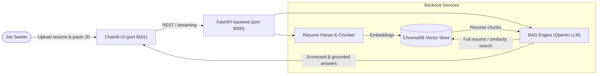

# 🎯 AI Job Application Suitability Chatbot

An AI-powered job application assistant that tells you **how well your resume matches a job description** and then helps you close the gaps: tailored resume bullets, cover letters and interview prep.

It is built on a **RAG (Retrieval-Augmented Generation)** pipeline using **ChromaDB**, **OpenAI** embeddings and LLM (`gpt-4o-mini` by default), a **FastAPI** backend, and a **Chainlit** chat UI.

---

## 🌟 Features

- **Resume ingestion:** upload **PDF**, **DOCX** or **TXT**. The text is split into section-aware chunks (Skills, Experience, Education, Projects…), embedded, and stored in a persistent local ChromaDB.
- **Job match scorecard:** paste a job description and get:
  - an **overall match score (0–100)** with a fit level (*Strong / Moderate / Low Fit*)
  - sub-scores for **skills**, **experience & seniority** and **education**
  - **key strengths** backed by evidence from the resume
  - **gaps**, labelled as must-have or nice-to-have
  - **missing ATS keywords**
  - **actionable tailoring recommendations**
- **Recruiter-style matching:** the LLM separates must-haves from nice-to-haves and weighs must-haves much more heavily. Synonyms and transferable skills count as partial matches (e.g. PostgreSQL counts for "SQL"), and it never invents experience that isn't in the resume.
- **Match questions in chat:** ask *"Am I a good fit?"* or *"What am I missing?"* at any point and you get a verdict, a table of each requirement with evidence, and next steps.
- **Career coach chat:** follow-up questions grounded in your resume and the JD, with streaming responses:
  - *"Rewrite my recent bullet points to include the missing keywords"*
  - *"Draft a cover letter for this role highlighting my strengths"*
  - *"What interview questions might they ask about my gaps?"*
- **Flexible input:** attach the resume and paste the JD in the same message, or send them in either order. Pasting a new JD later re-scores against it.

---

## 🏗️ Architecture



A detailed, editable flow diagram is in [`docs/resume_flow.excalidraw`](docs/resume_flow.excalidraw). Open it at [excalidraw.com](https://excalidraw.com) or with the VS Code Excalidraw extension.

### How a request flows

1. **Upload (once per resume).** `POST /api/resume/upload` extracts the text, chunks it, embeds each chunk and stores it in a ChromaDB collection for the session (`resume_<session_id>`). Re-uploading replaces the previous resume.
2. **Scorecard.** When a message looks like a job description, the UI calls `POST /api/evaluate`. For a normal-sized resume (≤ 24k characters) the **whole resume** is sent to the LLM rather than only the top-k chunks, so real skills aren't wrongly flagged as missing. Longer resumes fall back to a batched similarity search (skills / experience / education). The LLM returns structured JSON, and the scores are clamped and normalised.
3. **Chat.** `POST /api/chat/stream` handles follow-up messages:
   - **Match questions** (or a JD pasted into chat) get the full resume, the JD and a match-analysis prompt. If the resume or JD is missing, the bot asks for it instead of guessing.
   - **Other questions** only embed the question plus a JD snippet, and send the top-5 most similar resume chunks to the LLM.

> **Note:** chunking and embedding happen **only at upload**, not on every question. The JD is **not** stored in ChromaDB. It is held in memory in the Chainlit session and the backend's `session_jds` cache.

---

## 📁 Project Structure

```
ai_job_application_copilot/
├── backend/
│   └── app/
│       ├── main.py              # FastAPI endpoints & CORS
│       ├── config.py            # Environment settings
│       ├── models.py            # Pydantic schemas
│       └── services/
│           ├── parser.py        # PDF/DOCX/TXT text extraction & section-aware chunking
│           ├── vector_store.py  # ChromaDB persistent collection manager
│           └── rag_engine.py    # Match detection, scoring & RAG chat engine
├── chainlit_app/
│   └── app.py                   # Chainlit UI (upload, JD detection, scorecard, chat)
├── docs/
│   └── resume_flow.excalidraw   # End-to-end flow diagram
├── sample_data/
│   ├── sample_resume.txt        # Sample AI Engineer resume
│   └── sample_job_description.txt # Sample Senior AI Engineer JD
├── data/chroma_db/              # Persistent ChromaDB storage (auto-created)
├── chainlit.md                  # Chainlit welcome screen
├── requirements.txt             # Python dependencies
├── .env.example                 # Environment variable template
└── run.sh                       # Startup script
```

---

## ⚡ Quick Start

### 1. Install dependencies

Python 3.9+ is recommended.

```bash
python3 -m venv .venv
source .venv/bin/activate
pip install -r requirements.txt
```

### 2. Configure environment

```bash
cp .env.example .env
```

Edit `.env`:

```env
OPENAI_API_KEY=sk-your-openai-key-here
OPENAI_MODEL=gpt-4o-mini
OPENAI_EMBEDDING_MODEL=text-embedding-3-small
# Optional
CHROMA_DB_PATH=./data/chroma_db
BACKEND_URL=http://localhost:8000
```

If `OPENAI_API_KEY` is not set, ChromaDB falls back to its default local embedding model. Scoring and chat still need an OpenAI key.

### 3. Run

```bash
chmod +x run.sh
./run.sh            # backend + UI
./run.sh backend    # FastAPI only
./run.sh frontend   # Chainlit only
```

- **Chainlit UI:** http://localhost:8501
- **FastAPI:** http://localhost:8000 (Swagger docs at http://localhost:8000/docs)

> Restart both services after changing backend or UI code. `./run.sh` (all mode) does not auto-reload the backend.

---

## 🧪 Try It with Sample Data

1. Open http://localhost:8501.
2. Attach `sample_data/sample_resume.txt` with the paperclip icon.
3. Paste the contents of `sample_data/sample_job_description.txt` into the **same message** (or a later one), e.g.
   *"Is my resume a good fit for this job: <paste JD>"*
4. The resume is indexed and the **Job Suitability Scorecard** appears.
5. Ask follow-ups, such as *"How should I tailor my resume for the observability requirement?"*

---

## 🔌 API Endpoints

| Method | Endpoint | Description |
| :--- | :--- | :--- |
| `POST` | `/api/resume/upload` | Upload PDF/DOCX/TXT (`file`, `session_id` form fields); chunk, embed & store in ChromaDB |
| `POST` | `/api/evaluate` | Structured match scorecard: `{ "session_id", "job_description" }` |
| `POST` | `/api/chat` | RAG chat, full JSON response: `{ "session_id", "message", "job_description?", "history?" }` |
| `POST` | `/api/chat/stream` | Same as `/api/chat`, but streams plain-text tokens |
| `GET` | `/api/session/{session_id}/chunks` | Inspect all stored chunks for a session |
| `GET` | `/api/status` | Health check, OpenAI configuration, ChromaDB path and model |

Example:

```bash
curl -F "file=@sample_data/sample_resume.txt" -F "session_id=demo" \
  http://localhost:8000/api/resume/upload

curl -X POST http://localhost:8000/api/evaluate \
  -H "Content-Type: application/json" \
  -d "{\"session_id\": \"demo\", \"job_description\": $(jq -Rs . < sample_data/sample_job_description.txt)}"
```

---

## ⚠️ Known Limitations

- **Sessions are per chat.** Each new chat or page refresh creates a new `session_id`, so the resume has to be uploaded again. Old collections stay in `data/chroma_db/` until deleted.
- **JD cache is in memory.** Restarting the backend clears the `session_jds` cache.
- **JD detection is heuristic.** It looks for markers like "Requirements" and "Responsibilities" in longer text. Very short or unusual JDs might not be recognised; asking "am I a good fit?" after pasting still works through chat.
